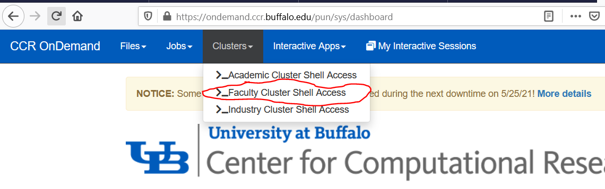
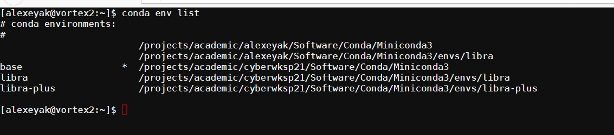
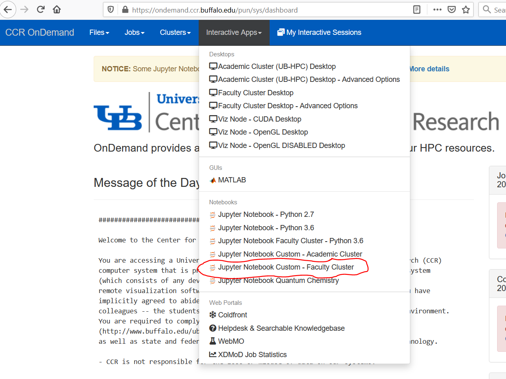

# Overview of the UB CyberInfrastructure

0. [VPN](#ubvpn)
1. [Project space](#project_space)
2. [OnDemand](#ondemand)
3. [Modules setup](#modules_setup)
4. [Conda](#conda)
5. [Using Jupyter on the OnDemand gateway](#ondemand-jupyter)

## 0.  Set up and verify UBVPN
 [Back to TOC](#toc)

In order to access the UB CCR computing resources and Open OnDemand, you must be running the UB
Virtual Private Network (VPN) software. Otherwise you will be unable to connect.
As a workshop participant you have been allocated a UB VPN account and a CCR username and account.
It is critical that you install this software and verify your access before the workshop begins.

VPN access also requires you perform two-factor authorization (2FA), which can be set up on a smartphone using Duo
Mobile app, available for Android (via [Google Play](https://play.google.com/store/apps/details?id=com.duosecurity.duomobile)) 
or iOS ([Apple Store](https://apps.apple.com/us/app/duo-mobile/id422663827)).

Before the workshop begins, please ensure you have:

- installed the provided [UB VPN software](http://www.buffalo.edu/ubit/service-guides/connecting/vpn/computer.html) on your own computer
- installed the [Duo Mobile](https://duo.com/product/multi-factor-authentication-mfa/duo-mobile-app) 2FA app onto your phone or other device
- successfully signed into the UB VPN software and used 2FA
- verified your access to
  [OnDemand](https://ubccr.freshdesk.com/support/solutions/articles/13000039875-ccr-ondemand-portal) at UB CCR (see sections below)

Once you have been through these steps, you are ready for the workshop!

Need help? Get stuck? Please submit a ticket: 
[ccr-help@buffalo.edu](http://www.buffalo.edu/ccr/support/ccr-help.html)

## 1.  Project space
 [Back to TOC](#toc)

As a workshop participant you have been allocated a UB CCR username and account. This provides a
home directory on CCR's high-performance computing resources and access to software and compute
nodes there.

In addition to your home directory, you have access to the workshop directory:

    /projects/academic/cyberwksp21

This folder contains the following sub-directories:

* `Instructors_material`
    Contains the examples or working data for the tutorials. You can access it to copy the content you need, but
    **Do not edit or view files in this directory at any time**. You can still `ls` directories to see the content, but
    do not `vi` the files. You may accidentally edit or change the files, which may affect other users, so please be mindful. 

* `Modules`
    Contains definitions and setups of the environmental variables for all users. **Do not edit or view files in this directory at any time**
    If you are curious on what is in there, feel free to first copy it to your working directory and then explore.

* `Software`
    Contains the installations of some packages, such as Conda (with the corresponding environments), or Libra.
    **Do not edit or view files in this directory at any time**. You can `ls` and `cd` there, to explore the content of
    directories, but do not operate on files. If you are curious about some of them, make your own copy first. 
    
* `Students`
    First, please create your own directory in this folder.

    This will be your working directory (apart from your home directory). This is where you can keep your data 
    and run some (small) calculations. Data in this directory are shared among the participants (those who have
    access to the UB resources), so you can take the advantage of that: e.g. if something doesn't work, you may 
    check our outher students' directories, but again - **Do not edit or view files in other students' directories at any time**

## 2. Open OnDemand
 [Back to TOC](#toc)

Open OnDemand is an application that enables access to high-performance computing resources through
a web portal (or "gateway"). A very detailed introduction is given [in this video](https://ub.hosted.panopto.com/Panopto/Pages/Viewer.aspx?id=c5c088f6-ba8c-4210-8d87-ab9f0104f54e)

[This website](https://ubccr.freshdesk.com/support/solutions/articles/13000039875-ccr-ondemand-portal) also 
provides the detailed step-by-step instructions for logging into the system, as well as a general overview of
the available tools.

          
## 3. Modules setup
 [Back to TOC](#toc)

### 3.1. **Edit your .bashrc** 

   Before you can use our Python installations via Jupyter, you need to edit your `.bashrc` file in your home directory.

   Once you have logged into OnDemand, go to Clusters -> Faculty Cluster Shell.

   {:width="80%"}

   Go to home directory and edit the `.bashrc` file

    cd 
    vi .bashrc

   Add the following line in the file

    module use /projects/academic/cyberwksp21/Modules

   This will enable both Jupyter (called from the OnDemand) access the 
   right installations as well as will enable you to acccess some specialized 
   modules. 

### 3.2. **Restart terminal or source .bashrc**

   Make sure you restart the terminal or `source .bashrc` for the above change to take effect

### 3.3. **Check the new modules**

   You can see all available modules via:

    module avail 

   In particular, as the result of our setup steps above, you shall be able to see modules that 
   are installed both as system-wide as as the ones for the current workshop 
   (defined in `/projects/academic/cyberwksp21/Modules` )

   {:width="80%"}

### 3.4. **Cheat sheet**

   * to check what modules are available 

         module avail

   * to load a module

         module load <module-name>

   * to list your loaded modules

         module list

   * to unload a module

         module unload <module-name>

   * to find out what does the modules load do (what kind of operations) and 
     where the module is located

         module show <module-name>

### 3.5. **Modules (packages) available**
 [Back to TOC](#toc)

  Modules are used to set the necessary paths so we can call and use different software packages on the
  cluster. 

  Here is the table of modules we will be concerned about in this workshop:

 |  Package/Module load command  |     Version      | Description                   |
 |-------------------------------|------------------|-----------------|
 |  columbus            |   7.0 2017-12-07-bin  | COLUMBUS electronic structure calculations package |
 |  cp2k                |   8.1-sse             | CP2K electronic structure calculations package |
 |  dftbplus            |   20.2.1-arpack       | DFTB+ for TD-DFTB calculations |
 |  eqe                 |  0.2.0                | embedded Quantum Espresso, for large-scale
 subsystem DFT simulations |
 |  ergoscf and ergoscf-mpi         |  3.8, with/without MPI   | ErgoSCF: electronic structure calculations package |
 |  jupyter             |                       | Contains Libra and other Python packages, such as psi4 (for Python), nano-qmflows, qmflows, py3Dmol, imageio, h5py, matplotlib, etc.  |
 |  lammps              |                       | Large-scale Atomic/Molecular Massively Parallel
 Simulator (LAMMPS), a classical MD code. |
 |  nexmd               |  Intel-mkl            | NEXMD package for nonadiabatic dynamics |
 |  nx                  |  2.2-B09              | Newton-X package for nonadiabatic dynamics  |
 |  qe                  |   6.2.1               | Quantum Espresso electronic structure calculations package  |
 |  qxmd                |                       | QXMD package for nonadiabatic dynamics      | 

 Example usage:
    
    module load nx
 

## 4. Conda and environments
 [Back to TOC](#toc)

### 4.1. Load the `jupyter` module.

    module load jupyter

  This will set up all the paths needed to execute packages such as Libra.

### 4.2. Activate Conda itself
 [Back to TOC](#toc)

  Before you can use any of the Conda environments or run/submit scripts *from the command
  line/terminal*,
  you need to activate Conda (don't worry about it, if you are running a Jupyter notebook from OnDemand).

  To do this, type in the terminal:

    eval "$(/projects/academic/cyberwksp21/Software/Conda/Miniconda3/bin/conda shell.bash hook)"

  after which the Conda installation for this workshop shall become available.

  You can check the available Conda environment by running:

    conda env list

  which should give something like this:

  {:width="80%"}
 
  In this example, disregard the first two lines of the output (i have another Conda installation).

  You can check what packages are included in any of the available Conda environments by:

    conda list -n <environment-name>

### 4.3. Activate the conda environment you want to use
 [Back to TOC](#toc)

  For our purposes, we want to use either `libra` or `libra-plus` environments

    conda activate libra

### 4.4. Summary: setup from the command line
 [Back to TOC](#toc)

  Sign on to `https://ondemand.ccr.buffalo.edu`

  In the OnDemand interface, select *App: Faculty Cluster Shell Access* and set up as follows:
    
  Prepare modules and environment

    module use /projects/academic/cyberwksp21/Modules
    
  Load jupyter

    module load jupyter
    
  Enable conda

    eval "$(/projects/academic/cyberwksp21/Software/Conda/Miniconda3/bin/conda shell.bash hook)"

  Now: you should be able to conda activate any needed environment, such as:

    conda activate qmflows

  or:

    conda activate libra-plus

  If you need any additional modules (see [Modules](#modules-avail) (packages) available), load them, such as:

    module load qxmd

## 5. Using Jupyter on the OnDemand gateway
 [Back to TOC](#toc)

### 5.1. Make sure you include the above `module use /projects/academic/cyberwksp21/Modules` line in
   your `.bashrc` file  (see the setep 2 above)

### 5.2. **Start Jupyter app from the OnDemand Portal**

   Select "Jupyter Notebook Custom - Faculty Cluster"

   {:width="80%"}

   This will create an interactive SLURM "job" which will allocate time, memory, and resources to run your
   Jupyter notebooks and the corresponding calculations. Since this is a SLURM job, we still need to do 
   a few more steps: indicate how much time and memory, how many CPUs and what kinds of clusters to use.

   During this workshop, we are going to use Akimov's group cluster, "valhalla". Considering we all will
   need to have a job running, please make sure you select only 1 node (can be more cores, if needed).
   For Jupyter jobs, we usually don't need to much of memory, so 2Gb (2000) is a good setup. 
   We will also request the job to last for 1 hour (or more). When the time runs out, you can just submit another job, so
   it is not critical. However, I recommend requesting as much time as you plan working on continuosly.

   Here are some possible setups:

   |         |            |
   |---------|------------|
   | {:width="100%"}   | {:width="100%"} |

   Once done, click "Launch". You shall be able to see the following results

   You will first see a prompt (table below, left panel) saying that the job is submitted and asking you to wait. It should
   not take too long to wait, if your request is reasonable (not too many cores/nodes, not too much memory/time). If it takes 
   too long, consider deleting the submitted job (Red "Delete" button) and submitting a new one.

   Once the resources are allocated to you, you should be able to start your Jupyter notebook (table below, right panel, red circle).
   You can also check what's going on with the job and see additional log and error messages if you click the link indicated (black circle).

   **Please make sure to Delete the job, if you no longer plan using the notebook on the OnDemand. Note: just closing the browser
   does not delete the job!**    

   |         |            |
   |---------|------------|
   | {:width="100%"}   | {:width="100%"} |

   Once your Jupyter job is started, it will provide you with a convenient way to navigate in your home directory. 

   You can then create new files or folders or open the existing ones. 
 
   {:width="80%"}

### 5.3. **Create a new Jupyter notebook**

   Go to `New -> Python 3.6 (libra-latest)` to create a new Jupyter notebook. By selecting the
   "Python3.6 (libra-latest)" kernel, you will have access to the pre-installed environment with 
   Libra and other dependencies (e.g. libint2, py3Dmol, psi4, etc.)

### 5.4. **Create a symbolic link to your project space directory**

   When you start Jupyter notebook you will have access to only your home directory.
   It is advisable to keep the working file in the /projects/academic/cyberwksp21/Students/\<yourid\>

   To access such a directory, create a soft link in your home directory:

    ln -s /projects/academic/cyberwksp21 ~/workshop

   Now, you can access all of your files located in the workshop project space. (see the red circle at the
   bottom of the above picture).

### 5.5. **Select correct kernel to run pre-existing Jupyter files**

   When you open an existing Jupyter notebook (e.g. one of the examples), if may not know that it needs to run
   the Python3.6 (libra-latest) kernel and may be pointing to the default Python 3 installation (which doesn't 
   have needed libraries).

   In this case, you would need to choose the kernel manually: 

    Kernel -> Change kernel -> Python3.6 (libra-latest)

   {:width="80%"}

   Make sure you also click "Kernel -> Restart" if it doesn't restart automatically (you would see a meessage
   in the top right corner, next to the name of the currently loaded kernel). 

 



