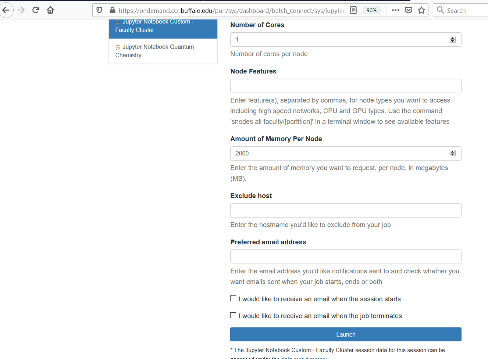

# Overview of the UB CyberInfrastructure

0. **BEFORE THE WORKSHOP**: [Set up and verify UBVPN](#ubvpn)
1. [User, Project, and Scratch space](#project_space)
2. [Open OnDemand](#ondemand)
3. [Modules at CCR](#modules_setup)
4. [Conda and environments](#conda)
5. [Using Jupyter on the OnDemand gateway](#ondemand-jupyter)
6. [Running interactive jobs: Cluster Desktop](#cluster-desktop)
7. [Running interactive jobs: Shell](#shell)

## 0. **BEFORE THE WORKSHOP**: Set up and verify UBVPN and CCR access
[Back to TOC](#toc)

As a workshop participant you have been allocated a UB VPN account and a CCR account.
In order to access CCR computing resources and Open OnDemand, you must be running the UB
Virtual Private Network (VPN) software. Otherwise you will be unable to connect.

It is critical that you install the VPN software and verify your access before the workshop begins.

### Your username

Workshop participants are assigned a VPN username that will be something like: `ub2999`. To
make it easier to remember, your CCR username has been created to match your VPN username. However, 
you must use different passwords for each of these services. 

:warning: Use the VPN password to log into UBVPN, and the CCR password to log into OnDemand!

### Workshop setup checklist

Before the workshop begins, please ensure that you have:

- installed the provided [UB VPN software](http://www.buffalo.edu/ubit/service-guides/connecting/vpn/computer.html) on your own computer
- signed into the UB VPN software 
- logged on and changed your CCR password
- verified your access to [OnDemand](https://ubccr.freshdesk.com/support/solutions/articles/13000039875-ccr-ondemand-portal) at CCR (see [OnDemand](#ondemand) section below)

Once you have been through these steps, you are ready for the workshop!

Need help? Get stuck? Please submit a ticket: 
[ccr-help@buffalo.edu](http://www.buffalo.edu/ccr/support/ccr-help.html)

## 1. User, project, and scratch space
[Back to TOC](#toc)

As a workshop participant you have been allocated a CCR username and account. This provides a 
home directory on CCR's high-performance computing resources and access to software and compute 
nodes there. Here we summarize the directories you will use.

### Home directory

Your CCR username will be something like `ub2999`. For that username, your home directory at CCR
would be:

    /user/ub2999

In your home directory, you are allotted 10GB of space for the duration of the workshop.

### Project directory

In addition to your home directory, you have access to the workshop directory:

    /projects/academic/cyberwksp21

This workshop directory contains the following sub-directories:

* `Instructors_material`
    Contains the examples or working data for the tutorials. You can access it to copy the content you need, but
    **Do not edit or view files in this directory at any time**. You can still `ls` directories to see the content, but
    do not `vi` the files. You may accidentally edit or change the files, which may affect other users, so please be mindful. 

* `Modules`
    Contains modulefiles, which are definitions and setups of the environmental variables for all users. 

* `Software`
    Contains the installations of some packages, such as Conda (with the corresponding environments), or Libra.
    **Do not edit or view files in this directory at any time**. You can `ls` and `cd` there, to explore the content of
    directories, but do not operate on files. If you are curious about some of them, make your own copy first. 
    
* `Students`
    Please create your own directory in this folder. The name should match your CCR username.

    If your CCR username is `ub2999`, create your directory from the command line by typing:

        mkdir -p /projects/academic/cyberwksp21/Students/ub2999

    This will be your working directory (apart from your home directory). This is where you can keep your data 
    and run some (small) calculations. Data in this directory are shared among the participants (those who have
    access to the UB resources), so you can take the advantage of that: e.g. if something doesn't work, you may 
    check our outher students' directories, but again - **Do not edit or view files in other students' directories at any time**

### Scratch space
[Top of Section](#project_space)

In addition to the directories above, you have access to the workshop scratch directory:

    /panasas/scratch/grp-cyberwksp21

This directory is useful for writing temporary files or results. You may create a directory there
for your own use. If your CCR username is `ub2999`, create a scratch directory named:

    /panasas/scratch/grp-cyberwksp21/ub2999

You can do this on the command line by typing:

    mkdir -p /panasas/scratch/grp-cyberwksp21/ub2999

## 2. Open OnDemand
[Back to TOC](#toc)

Open OnDemand is an open-source application that enables access to high-performance computing resources through a web portal (or "gateway").  We will use it to run both Jupyter Notebooks and command line sessions during this workshop.

:computer: To access the portal, first ensure you are connected to the UB VPN, then, [log in to CCR OnDemand](https://ondemand.ccr.buffalo.edu)

For detailed step-by-step instructions for logging into the OnDemand system, and information about the available tools:

- [How to log in](https://ubccr.freshdesk.com/support/solutions/articles/13000039875-ccr-ondemand-portal) 
- [Using the Files app](https://ubccr.freshdesk.com/support/solutions/articles/13000071814-how-to-use-file-app-in-ondemand): transfer, view, and edit files 
- [Jupyter Notebook app](https://ubccr.freshdesk.com/support/solutions/articles/13000080146-jupyter-notebook-app-faculty-cluster): how to use Jupyter in OnDemand
- [OnDemand Faculty Cluster app](https://ubccr.freshdesk.com/support/solutions/articles/13000080146-jupyter-notebook-app-faculty-cluster):
- [Video overview](https://ub.hosted.panopto.com/Panopto/Pages/Viewer.aspx?id=c5c088f6-ba8c-4210-8d87-ab9f0104f54e)

### First time OnDemand access 

If you are logging on for the first time, click `Clusters -> Faculty Cluster Shell Access`, as shown in the screenshot:

   {:width="80%"}

When the terminal prompt appears, run this command in the terminal:

    /util/ccr/bin/ssh_no_password.sh

Finally, while you are on the terminal prompt, make a link to the project space for use with Jupyter Notebooks by typing
the following:
        
    ln -s /projects/academic/cyberwksp21 ~/workshop
          

## 3. Modules at CCR
[Back to TOC](#toc)

Software modules allow us to use specialized software packages on the CCR computing
cluster. In this section we'll set up to use modules, and describe how to use them and what they are for.

### 3.1. Edit your .bashrc
[Back to TOC](#toc)

   Before you can use our Python installations via Jupyter, you need to edit the `.bashrc` file in your home directory.
   We will use the OnDemand Files app for this task.

   1. Once you have logged into OnDemand, go to Files -> Home Directory to open the Files app.
   {:width="80%"}

   2. Click the "Show Dotfiles" checkbox.

   3. Use the Filter textbox, or just scroll down, to find your .bashrc file.

   4. On the .bashrc file's line, click the selection box and select "Edit". 

   {:width="80%"}

   5. A new browser window will appear with a simple editor inside. Help for using the OnDemand Files app is [available.](https://ubccr.freshdesk.com/support/solutions/articles/13000071814-how-to-use-file-app-in-ondemand)

   Add the following two lines to your .bashrc file:

    module use /projects/academic/cyberwksp21/Modules
   
    export SLURM_CONF=/util/ccr/slurm/slurm-faculty.conf

   6. When your edits are complete, click Save (upper left corner), then close the edit
   window.

   7. Optionally, you can view your changes to verify they were saved. In the Files app, make note of the
   timestamp on your .bashrc (shown in Eastern Daylight time, UTC-4), and click the selection box and "View" to
   confirm your changes visually.

   #### What did we change?

   The first line we added will enable Jupyter (called from OnDemand) to access the workshop installs, and will enable you to acccess some specialized modules. 

   The second line we added will set the default cluster value for running jobs at CCR.

   :information_source: You can use the OnDemand Files app for other editing tasks during the
   workshop. Consult the
   [documentation](https://ubccr.freshdesk.com/support/solutions/articles/13000071814-how-to-use-file-app-in-ondemand)
   for the Files app.

### 3.2. Restart terminal or source .bashrc

   Make sure you restart the terminal or `source .bashrc` for the above change to take effect.

### 3.3. Check the new modules
[Top of Section](#modules_setup) \| [Back to TOC](#toc)

   You can see all available software modules (called just "modules") by typing:

    module avail 

   In particular, as the result of our setup steps above, you shall be able to see modules that 
   are installed both as system-wide as as the ones for the current workshop 
   (defined in `/projects/academic/cyberwksp21/Modules`)

   This screenshot shows modules we will use for the workshop. An "L" next to a module indicates that it is currently loaded in the terminal session.

   {:width="80%"}

### 3.4. Modules cheat sheet
[Top of Section](#modules_setup) \| [Back to TOC](#toc)

The following module commands will come in handy:

   * to check what modules are available 

         module avail

   * to load a module

         module load <module-name>

   * to list your loaded modules

         module list

   * to unload a module

         module unload <module-name>

   * to find out what does the modules load do (what kind of operations) and where the module is located

         module show <module-name>

### 3.5. Modules for the workshop
[Top of Section](#modules_setup) \| [Back to TOC](#toc)

  Modules are used to set the necessary paths so we can call and use different software packages on the
  cluster. Here are the modules we will be concerned about in this workshop:

 |  Package/Module load command  |     Version      | Description                   |
 |-------------------------------|------------------|-----------------|
 |  columbus            |   7.0 2017-12-07-bin  | COLUMBUS electronic structure calculations package |
 |  cp2k                |   8.1-sse             | CP2K electronic structure calculations package |
 |  dftbplus            |   20.2.1-arpack       | DFTB+ for TD-DFTB calculations |
 |  eqe                 |  0.2.0                | embedded Quantum Espresso, for large-scale subsystem DFT simulations |
 |  ergoscf          |  3.8, without MPI   | ErgoSCF: electronic structure calculations package |
 |  ergoscf-mpi         |  3.8, with MPI   | ErgoSCF: electronic structure calculations package |
 |  jupyter             |                       | Contains Libra and other Python packages, such as psi4 (for Python), nano-qmflows, qmflows, py3Dmol, imageio, h5py, matplotlib, etc.  |
 |  lammps              |                       | Large-scale Atomic/Molecular Massively Parallel Simulator (LAMMPS), a classical MD code. |
 |  nexmd               |  Intel-mkl            | NEXMD package for nonadiabatic dynamics |
 |  nx                  |  2.2-B09              | Newton-X package for nonadiabatic dynamics  |
 |  qe                  |   6.2.1               | Quantum Espresso electronic structure calculations package  |
 |  qxmd                |                       | QXMD package for nonadiabatic dynamics      | 

 Example usage:
    
    module load nx

 
## 4. Conda and environments
[Back to TOC](#toc)

In the workshop we will use conda to control which Python packages are loaded and available.
This is important to do when running on the command line.  Jupyter Notebooks, however, takes care of
this detail for us.
This section will show you how to set up conda environments to run from an OnDemand command line. 

Note: Here we assume that you have already included the workshop `module use` line in your .bashrc, as described in 
[.bashrc setup](#bashrc-edit).

### Load jupyter

    module load jupyter

  This will set up all the paths needed to execute packages such as Libra.

  You can check this by entering `which jupyter`. The system should return: 

    /projects/academic/cyberwksp21/Software/Conda/Miniconda3/envs/libra/bin/jupyter

### Activate conda 

  Before you can use any of the Conda environments or run/submit scripts *from the command
  line/terminal*,
  you need to activate Conda (don't worry about this if you are running a Jupyter notebook).

  To do this, type in the terminal:

    eval "$(/projects/academic/cyberwksp21/Software/Conda/Miniconda3/bin/conda shell.bash hook)"

  Now the Conda installation for this workshop will be available, and
  the default conda environment, `base`, will be loaded. You can see this by the `(base)` that precedes 
  your system prompt.

  You can check the available Conda environments by running:

    conda env list

  which should give something like this:

    base      *  /projects/academic/cyberwksp21/Software/Conda/Miniconda3
    libra-plus   /projects/academic/cyberwksp21/Software/Conda/Miniconda3/envs/libra-plus
    qmflows      /projects/academic/cyberwksp21/Software/Conda/Miniconda3/envs/qmflows

  Notice that the currently active environment is indicated with an asterisk character (\*).

  You can list the packages included in any available Conda environment by typing:

    conda list -n <environment-name>

### Specify a conda environment 

  For our purposes, we want to use either `qmflows` or `libra-plus` environments:

    conda activate libra-plus

  Note that the prompt changes to show the new conda environment.

  Now you are ready to use Libra from the command line!
 

## 5. Using Jupyter Notebooks on the OnDemand gateway
[Back to TOC](#toc)

Jupyter Notebooks are a great approach to interactive computing. In the OnDemand environment,
your notebook runs right on a CCR compute node, with access to the workshop codes. We need to
specify the right parameters so that the CCR resource manager, SLURM, can allocate computing resources to
your notebook.

### SLURM parameters

Each time you request a SLURM job during the workshop you will specify certain parameters. Notebooks
are no different. Use the following to access workshop compute nodes:

SLURM parameter | value |
------------- | -------- | 
account | cyberwksp21
cluster | faculty
partition | valhalla
qos | valhalla

You will also specify the number of hours, nodes, and cores for your notebook: 

SLURM parameter | value |
------------- | -------- | 
Number of nodes | Always select 1
Number of cores | Typically 1, may be more
Memory | 2000 (= 2GB)
Number of hours | At least 1 hour, can select full day

### 5.1. Check your `.bashrc` file 

Make sure you include the `module use /projects/academic/cyberwksp21/Modules` line in
   your `.bashrc` file  (Refer to [.bashrc](#bashrc-edit) setup, above).

### 5.2. Start the Jupyter app from the OnDemand Portal
[Top of Section](#ondemand-jupyter) \| [Back to TOC](#toc)

   Select `Interactive Apps -> Jupyter Notebook Quantum Chemistry`

   {:width="80%"}

   This will create an interactive SLURM job which will allocate time, memory, and resources to run your
   Jupyter notebooks and the corresponding calculations. Since this is a SLURM job, we still need to do 
   a few more steps: indicate how much time and memory, how many CPUs, and what cluster to use.

   During this workshop, we are going to use Akimov's group computing partition, "valhalla". Considering we all will
   need to have a job running, please make sure you select only 1 node (can be more cores, if needed).
   For Jupyter jobs, we usually don't need much memory, so 2Gb (2000) should be sufficient. 
   We will also request the job to last for 1 hour (or more). When the time runs out, you can just submit another job, so
   it is not critical. However, I recommend requesting as much time as you plan working on continuosly.

   This example shows appropriate parameters for your job:

   |         |            |
   |---------|------------|
   | {:width="100%"}   | {:width="100%"} |

   Once done, click "Launch". You shall be able to see the following results:

   You will first see a prompt (table below, left panel) saying that the job is submitted and asking you to wait. It should
   not take too long to wait, if your request is reasonable (not too many cores/nodes, not too much memory/time). If it takes 
   too long, consider deleting the submitted job (Red "Delete" button) and submitting a new one.

   Once the resources are allocated to you, you should be able to start your Jupyter notebook (table below, right panel, red circle).
   You can also check what's going on with the job and see additional log and error messages if you click the link indicated (black circle).

   **Please make sure to Delete the job, if you no longer plan using the notebook in OnDemand. Just closing the browser
   does not delete the job!**    

   |         |            |
   |---------|------------|
   | {:width="100%"}   | {:width="100%"} |

   Once your Jupyter job is started, it will provide you with a convenient interface for navigating in your home directory, as shown below. 

   You can then create new files or folders or open the existing ones. 
 
   {:width="80%"}

### 5.3. Creating a new Jupyter notebook
[Top of Section](#ondemand-jupyter) \| [Back to TOC](#toc)

   Go to `New -> Python 3.6 (libra-latest)` to create a new Jupyter notebook. By selecting the
   "Python3.6 (libra-latest)" kernel, you will have access to the pre-installed environment with 
   Libra and other dependencies (libint2, py3Dmol, psi4, etc.)

### 5.4. Symbolic link to project space 
[Top of Section](#ondemand-jupyter) \| [Back to TOC](#toc)

   When you start the Jupyter notebook app, you will only have access to your home directory.
   For this workshop, it will be useful to keep working files in /projects/academic/cyberwksp21/Students/\<yourid\>

   To easily access this directory, create a soft link in your home directory:

    ln -s /projects/academic/cyberwksp21 ~/workshop

   Now, you can easily access all of your files located in the workshop project space. (see the red circle at the
   bottom of the above picture).

### 5.5. Changing the kernel for an existing notebook
[Top of Section](#ondemand-jupyter) \| [Back to TOC](#toc)

   Most workshop notebooks require either the `libra-latest` or `qmflows` Python 3 kernels.

   When you open an existing Jupyter notebook (e.g. one of the examples), it may 
   be pointing to the default Python 3 kernel, which doesn't have the needed libraries.

   In this case, you simply need to choose the kernel manually: 

    Kernel -> Change kernel -> Python3.6 (libra-latest)

   {:width="80%"}

   You can click `Kernel -> Restart` if it doesn't restart automatically (you may see a message
   in the top right corner, next to the name of the currently loaded kernel). 

   Click the Save icon (or File -> Save) to ensure your kernel choice is saved in the notebook.

## 6. Running interactive jobs on the OnDemand gateway 
[Back to TOC](#toc)

To run interactive jobs from OnDemand we will run the Faculty Cluster Desktop Advanced app.
While running this app you have access to part of a node on the valhalla partition at CCR.

Each valhalla computing node has 12 or 24 cores. Note that the Faculty Cluster Desktop Advanced enables you to select
a *subset of the cores* on the node, which will be sufficient for workshop tasks. Your
instructor will tell you how many cores to request (most likely 4).

Since all workshop attendees share computing resources, we will select Advanced and share these nodes!

Documentation for this app: [OnDemand Cluster Desktop](https://ubccr.freshdesk.com/support/solutions/articles/13000080146-jupyter-notebook-app-faculty-cluster)

To start it, sign in to OnDemand, then select `Apps -> Faculty Cluster Desktop - Advanced Options`.

   {:width="80%"}

## 6.1 Requesting resources from SLURM
[Top of Section](#cluster-desktop) \| [Back to TOC](#toc)

The Faculty Cluster Desktop Advanced app reserves part of a computing node for your interactive
jobs. You specify the parameters that will govern your jobs. These parameters will be sent in a request to
the cluster resource manager SLURM.

   **Please make sure to Delete the job, freeing these resources, if you are finished using the app in OnDemand. Just closing the browser does not delete the job!**    

Specify the SLURM parameters in the user interface. You will request:

SLURM parameter | value |
------------- | -------- | 
SLURM Account | cyberwksp21
Partition | valhalla
QOS | valhalla
Number of hours | 1 or more
Number of nodes | Always select 1
Number of cores | 4 (or as suggested by instructor)
Memory | (Optional--as suggested by instructor)

Then, click Launch to submit your request.

   {:width="80%"}

OnDemand will send your request to SLURM, which will prepare the resources for your job. OnDemand
will display the status of your request, as shown here:

   {:width="80%"}

When the resources are ready, you will be prompted to launch the desktop by clicking "Launch Faculty
Cluster Desktop - Advanced", as shown here:

   {:width="80%"}

Once you are running the Desktop app, click the blank terminal icon, as shown, to start a terminal emulator. The terminal 
will run directly on your requested compute node.

You are now running the Desktop app. A bit more setup, described below, will prepare the app so
you can run interactive jobs in this workshop.

   {:width="80%"}

### 6.1. Load jupyter
[Top of Section](#cluster-desktop) \| [Back to TOC](#toc)

Note: Here we assume that you have already included the workshop `module use` line in your .bashrc, as described in 
[.bashrc setup](#bashrc-edit).

In the OnDemand Faculty Cluster Desktop (Advanced), click the terminal icon to start a terminal emulator. Then, on the terminal command line, type:

    module load jupyter

  This will set up all the paths needed to execute packages such as Libra.

  To verify the correct setup, entering `which jupyter` will return:

    /projects/academic/cyberwksp21/Software/Conda/Miniconda3/envs/libra/bin/jupyter

### 6.2. Activate conda 
[Top of Section](#cluster-desktop) \| [Back to TOC](#toc)

  Before you can use any of the Conda environments or run/submit scripts *from the command
  line/terminal*,
  you need to activate Conda.  To do this, type in the terminal:

    eval "$(/projects/academic/cyberwksp21/Software/Conda/Miniconda3/bin/conda shell.bash hook)"

  Now, the Conda installation for this workshop will be available, with the base environment
  activated.

  You can check the available Conda environments by running:

    conda env list

  which should show you something like this:

    base      *  /projects/academic/cyberwksp21/Software/Conda/Miniconda3
    libra-plus   /projects/academic/cyberwksp21/Software/Conda/Miniconda3/envs/libra-plus
    qmflows      /projects/academic/cyberwksp21/Software/Conda/Miniconda3/envs/qmflows

  Notice that the currently active environment is indicated with an asterisk character (\*).
  By default, your current environment will also be shown by name in parentheses at the 
  beginning of your command prompt.
 
  You can list the packages included in any of the available Conda environments this way:

    conda list -n <environment-name>

### 6.3. Activate a conda environment 
[Top of Section](#cluster-desktop) \| [Back to TOC](#toc)

  For the workshop, we typically use either `qmflows` or `libra-plus` environments. To activate
  libra-plus, type:

    conda activate libra-plus

### 6.3. Load additional modules
[Top of Section](#cluster-desktop) \| [Back to TOC](#toc)

  You can now load any other modules you need for your command line work. Refer to the
  [Modules](#modules-avail) section above for more information.

### 6.4. Summary: interactive jobs setup: Cluster Desktop app 
[Top of Section](#cluster-desktop) \| [Back to TOC](#toc)

  Here we summarize the steps to prepare for interactive work on the OnDemand Cluster app.

  1. Ensure you are signed onto the UB VPN.  Sign on to `https://ondemand.ccr.buffalo.edu` using your CCR account and password.

  Note: Here we assume that you have already included the workshop `module use` line in your .bashrc, as described in 
  [.bashrc setup](#bashrc-edit).

  2. In the OnDemand user interface, select *App: Faculty Cluster Desktop (Advanced)* and specify the
  [SLURM](#slurm-interactive) parameters for the job.

  3. When the Desktop app is ready, click Launch Faculty Cluster Desktop (Advanced) and then start a Terminal
  Emulator.

  4. From the terminal command line, load jupyter and enable conda:
    
    module load jupyter
    
    eval "$(/projects/academic/cyberwksp21/Software/Conda/Miniconda3/bin/conda shell.bash hook)"

  5. Now you can activate a conda environment, such as:

    conda activate qmflows

  6. Additional software modules (see [Modules](#modules-avail)), can be loaded, such as:

    module load qxmd

  Now you are prepared to run interactive jobs in the OnDemand Faculty Cluster Desktop (Advanced)
  app! 

[Back to TOC](#toc)



